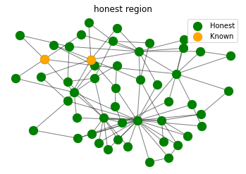
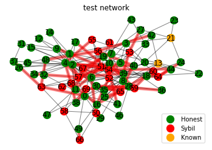
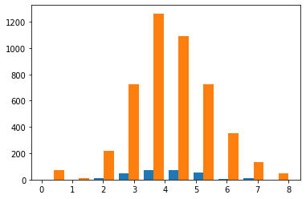
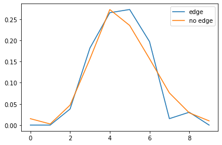
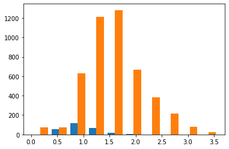
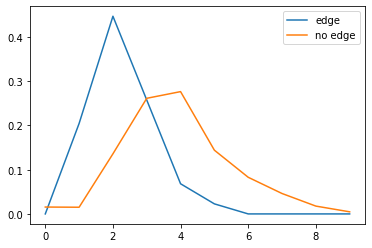

# Identication of Sybil attacks on social network based on user interactions

### Project Overview:

In this project we have identified the sybil node and communities in fb and synthetic graph dataset.For eg. In case of Facebook network the Facebook users can be modelled as nodes and if two users are friends, then it can be the link between these nodes.

### Sybil Attack : 
It’s an attack in which a node in the network operates multiple identities actively at the same time and tries to control the majority of the network.It has  the potential to compromise the whole distributed network.
With the growing social network, the size of network increases drastically and therefore, the chances of sybil attack also increases.
Sybil detection approaches in Online Social Networks(OSNs) can be classified into two categories: feature-based approach and social-graph-based approach.
 In feature-based Sybil detection approaches, we focus on extracting features from users’ profiles  and observing user activity patterns to derive a machine-learning based model to identify fake/Sybil user accounts. 
In social-graph based approaches, we exploit the topological properties of OSN graphs such as fast-mixing, and conductance to identify Sybil nodes.


##### The proposed method includes following 3 steps:
1. First, we transform the social network graph, which is initially considered as an undirected and unweighted graph into an undirected weighted graph by a process called Jaccard index and Louvain algorithm.For this , we have used Sypy,Python package for Sybil node detection in social and information networks.Sypy includes Louvain algorithm. 
2. In the next phase, we take advantage of interactions between users to distinguish them into communities with similar characteristics (Honest or Sybil). Also there is need to know atleast one known node (means the node which is surely honest).
3. In the last step, Using dfs we choose the community which will have the known node as honest and other as Sybil.

 SybilRank, a Sybil communities detection algorithm for Online Social Networks, which uses the topological properties of communities in Online Social Networks for the Sybil identification




### Prerequisites:

##### Software requirements
  - Python (3.3 Or later)
  - numpy
  - scipy
  - matplotlib
  - networkx

And can be installed by following commands

```
$ pip install numpy
$ pip install scipy
$ pip install matplotlib
```


### Implementation details: 

The whole information about the implementation is available from the Python notebook ***cybersypy.ipynb***,  which describes the overall flow of the whole program.

### Results:







### References:

[Graph-based Sybil Detection in Social and Information Systems](http://lersse-dl.ece.ubc.ca/record/284/files/ASONAM_2013.pdf)


### Contact us:
If you have problems, questions, ideas or suggestions, please contact us by posting to this mailing list-

* Deeksha Chouksey- deekshachouksey888@gmail.com
* Anjali Agrawal- anjaliagrawal.anj@gmail.com
